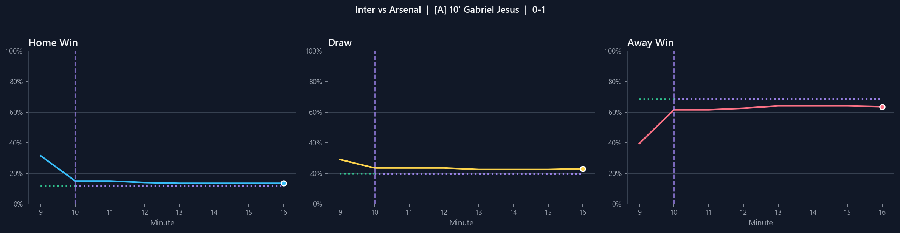
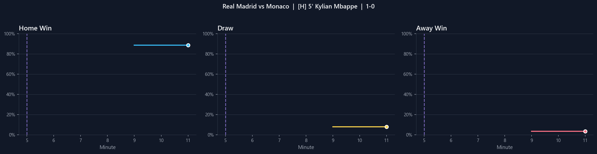

# Live Football Odds Predictor

Statistical model that predicts how football match probabilities change in real-time using Poisson/Skellam distributions.

## Overview

During a live football match, the probability of each outcome (Home Win, Draw, Away Win) changes as goals are scored. This project implements a mathematical model to predict these probability shifts instantly using:

- **Poisson distribution** for modeling goal-scoring rates
- **Skellam distribution** for predicting match outcomes
- **Dual calibration** from live betting market data (Over/Under + 1X2)

## The Math

The mathematical foundation is detailed in [`docs/model.pdf`](docs/model.pdf) (coming soon).

**Key concepts:**

1. Goals scored by each team follow independent Poisson processes with rates λ_home and λ_away
2. The difference of two Poisson variables follows a Skellam distribution
3. We calibrate λ values from live market prices using a dual approach:
   - **O/U prices → m** (total expected remaining goals)
   - **1X2 prices → q** (home team's share of remaining goals)
   - Combined: `λ_home = m × q`, `λ_away = m × (1-q)`

## Validation Results

Tested on **42 goals** across **13 matches** (Premier League + Champions League):

| Metric | Value |
|--------|-------|
| Mean Absolute Error | **8.0%** |
| Median Absolute Error | **6.0%** |
| Predictions within 5% | 43% |
| Predictions within 10% | **79%** |

### Example: Inter vs Arsenal (UCL)

Gabriel Jesus scores for Arsenal in the 10th minute:



- **Colored lines**: Actual market probabilities
- **Green dotted**: Model prediction (pre-goal)
- **Purple dotted**: Locked prediction (post-goal)

### Example: Real Madrid vs Monaco (UCL)

Mbappé opens the scoring in the 5th minute:



## Project Structure

```
src/
├── poisson_model.py    # Core probability calculations
└── visualize.py        # Chart generation (dark mode)

validation/
├── results.csv         # 42 goals with predictions vs actual
└── plots/              # Example visualizations

docs/
└── model.pdf           # Mathematical derivation (LaTeX)
```

## Usage

```python
from src.poisson_model import FootballPredictor, Probabilities

# Initialize predictor
predictor = FootballPredictor()

# Update with current match state
predictor.update(
    minute=30,
    home_goals=0,
    away_goals=0,
    market_1x2=Probabilities(home_win=0.50, draw=0.28, away_win=0.22),
    ou_prices={2.5: 0.55, 3.5: 0.30}  # Optional: improves accuracy
)

# Predict what happens if home team scores
impact = predictor.predict_goal_impact(home_scores=True)

print(f"Home win: {impact.new_1x2.home_win:.1%} ({impact.delta_home_win:+.1%})")
print(f"Draw:     {impact.new_1x2.draw:.1%} ({impact.delta_draw:+.1%})")
print(f"Away win: {impact.new_1x2.away_win:.1%} ({impact.delta_away_win:+.1%})")
```

Output:
```
Home win: 73.2% (+23.2%)
Draw:     18.1% (-9.9%)
Away win: 8.7% (-13.3%)
```

## Requirements

```
numpy
scipy
matplotlib
pandas
```

## Applications

- Sports analytics and research
- Understanding probability dynamics in football
- Educational tool for Poisson processes
- Benchmarking prediction models

## License

MIT

---

*Built for research and educational purposes.*
