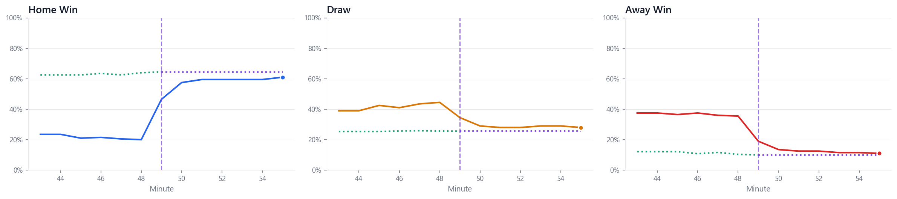

# Live Football Odds Predictor

Statistical model that predicts how football match probabilities change in real-time when a goal is scored, using Poisson/Skellam distributions.

Given live betting market data (1X2 and Over/Under prices), the model calibrates Poisson rates and computes what the new Home/Draw/Away probabilities should be after a goal — before the market has fully reacted.

## The Math

The full mathematical derivation is in [`docs/model.pdf`](docs/model.pdf) ([LaTeX source](docs/model.tex)).

Goals scored by each team follow independent Poisson processes. The difference of two Poisson variables follows a Skellam distribution, which we use to compute match outcome probabilities. We calibrate the Poisson rates from live market data using **dual calibration**:

- **Over/Under prices -> m**: Market-implied probability of Over X.5 goals (e.g., P(Over 2.5) = 55%) lets us solve for `m`, the total expected remaining goals
- **1X2 prices -> q**: Match winner probabilities (Home/Draw/Away) let us solve for `q`, the home team's share of remaining goals
- **Combined**: `lambda_home = m * q`, `lambda_away = m * (1-q)`

## Quick Start

```bash
pip install -r requirements.txt
py example.py        # run the model on a sample match
py validate.py       # reproduce MAE on all 20 goals
py validate.py 6     # view detailed prediction for goal #6
py validate.py plot  # generate validation plots from orderbook data
```

## Validation

Tested on **20 goals** across **10 matches** (Champions League, Serie A, La Liga, Liga 1 Romania, Saudi Pro League):

| Metric | Value |
|--------|-------|
| Mean Absolute Error | **4.4%** |
| Median Absolute Error | **3.6%** |
| Predictions within 5% | 65% |
| Predictions within 10% | **100%** |

### Example: Udinese vs Roma

Ekkelenkamp scores for Udinese in the 49th minute (1-0):



- **Colored lines**: Actual market probabilities over time
- **Green dotted**: Model prediction before the goal (what the model expects the market to jump to)
- **Purple dotted**: Locked prediction after the goal (held constant to compare against where the market actually settled)

## Project Structure

```
example.py              # Run the model on a sample match
validate.py             # Reproduce MAE, view predictions, generate plots
src/
  poisson_model.py      # Core: Skellam, dual calibration, prediction
  visualize.py          # Chart plotting
validation/
  results.csv           # 20 goals with market inputs and actuals
  orderbooks/           # Minute-by-minute orderbook logs for validation matches
  plots/                # Validation visualizations
docs/
  model.tex             # LaTeX paper with full derivation
```

## Usage

```python
from src.poisson_model import FootballPredictor, Probabilities

predictor = FootballPredictor()
predictor.update(
    minute=30,
    home_goals=0,
    away_goals=0,
    market_1x2=Probabilities(home_win=0.50, draw=0.28, away_win=0.22),
    # Over/Under prices: {goal_line: P(over)}
    # e.g. 55% chance of over 2.5 goals, 30% chance of over 3.5
    ou_prices={2.5: 0.55, 3.5: 0.30}
)

# What happens if home scores next?
impact = predictor.predict_goal_impact(home_scores=True)
print(f"Home win: {impact.new_1x2.home_win:.1%} ({impact.delta_home_win:+.1%})")
# Home win: 75.4% (+25.4%)
```

## License

MIT
